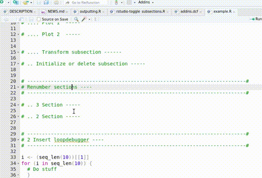
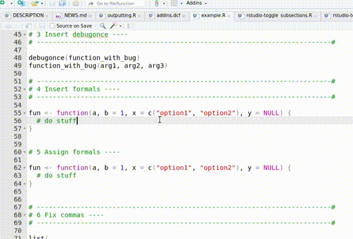
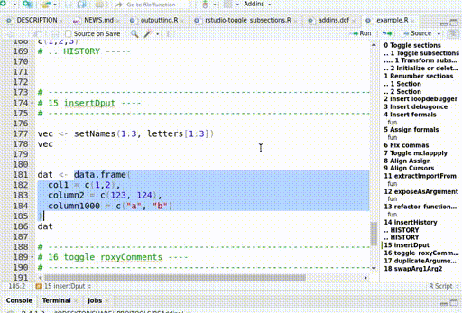

# RStudio addins

This collection is a collection of semi-heuristic addins for RStudio.
Their quality depends on when they were written.

# Shortcuts

**Install** keyboard shortcuts with

```
RSAddins::installRSkeybindings()
```

**Print** keyboard shortcuts with

```
RSAddins::printRSShortcuts()
```

|Function                      |Shortcut         |
|:-----------------------------|:----------------|
|alignAssign                   |Ctrl+Q           |
|alignCursor                   |Ctrl+Shift+Q     |
|toggle_subsection             |Ctrl+Y           |
|toggle_subsubsection          |Ctrl+Shift+Y     |
|insertFormals                 |Ctrl+Shift+Alt+I |
|assignFormals                 |Ctrl+Shift+Alt+O |
|fixCommas                     |Ctrl+Alt+Z       |
|exposeAsArgument              |Ctrl+Alt+C       |
|toggle_mclapply               |Ctrl+Shift+G     |
|insert_debugonce              |Ctrl+Shift+Alt+G |
|transform_subsection          |Ctrl+J           |
|initiate_or_delete_subsection |Ctrl+Shift+J     |
|renumber_sections             |Ctrl+Shift+R     |
|insert_loopdebugger           |Ctrl+Shift+I     |
|toggle_blabla                 |Ctrl+Alt+O       |
|extract_importFrom            |Ctrl+Alt+I       |
|refactor_functionCall         |Ctrl+Alt+U       |
|insertHistory                 |Ctrl+Alt+H       |
|insertDput                    |Ctrl+Shift+Alt+H |
|clipr::clipr_result           |Ctrl+Shift+Alt+E |
|toggle_roxyComments           |Ctrl+Shift+Alt+C |
|swapArg1Arg2                  |Ctrl+Shift+Alt+D |
|duplicateArguments            |Ctrl+O           |


# Examples

## 01-toggle-sections

## 02-toggle-subsections

## 03-toggle-subsubsections

## 04-transform-subsection

## 05-initialize-subsection

## 06-renumber-subsections

## 07-insert-loopdebugger

## 08-insert-debugonce

## 09-insert-formals

## 10-fix-commas

## 11-toggle-mclapply

## 12-align-assign

## 13-align-cursors

## 14-extract-importfrom

## 15-expose-as-argument

## 16-refactor-funcall

## 17-insert-history

## 18-insert-dput-df

## 18-insert-dput

## 19-toggle-royxycomments

## 20-duplicate-args

## 21-swap-args


